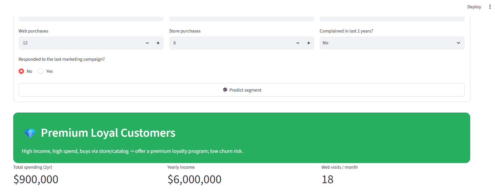
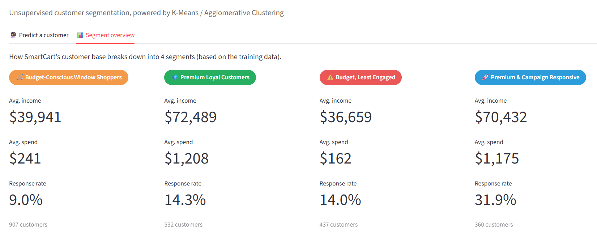

# 🛒 SmartCart — Customer Segmentation with Unsupervised Machine Learning

An end-to-end customer segmentation system for an e-commerce platform.
Raw customer data (demographics, spending, website activity) is grouped into
meaningful segments using **unsupervised clustering (K-Means / Agglomerative
Clustering)**, then served through an interactive **Streamlit** web app that
predicts a new customer's segment in real time.

**🔗 Live demo:** https://yogya-smartcart-clustering.streamlit.app/


## 📸 Screenshots






---

## 🧠 Problem Statement

SmartCart currently applies generic, one-size-fits-all marketing to every
customer, leading to inefficient spend, missed retention opportunities, and
delayed churn detection. This project builds a data-driven segmentation
model so marketing can be personalised per customer segment.

## 🔍 Approach

| Stage | What was done |
|---|---|
| Data cleaning | Filled missing `Income` values with the median |
| Feature engineering | Derived `Age`, `Total_Spending`, `Customer_Tenure_Days`, `Total_Children`, `Living_With` |
| Encoding & scaling | One-hot encoding for categoricals + `StandardScaler` |
| Dimensionality reduction | PCA → 3 components |
| Choosing k | Elbow method + Silhouette score → **k = 4** |
| Clustering | K-Means and Agglomerative Clustering (ward linkage) |
| Interpretation | Each cluster profiled and named based on income/spend/engagement patterns |
| Deployment | Model artifacts saved with `joblib`, served via a Streamlit app |

## 🏷️ Segments discovered

| Segment | Profile |
|---|---|
| 💎 Premium Loyal Customers | High income & spend, buys via store/catalog, low churn risk |
| 🚀 Premium & Campaign Responsive | High income & spend, highest campaign response rate — best ROI segment |
| 🛒 Budget-Conscious Window Shoppers | High web visits, low spend — needs conversion-focused offers |
| ⚠️ Budget, Least Engaged | Lowest spend & response — highest churn risk |

## 🛠️ Tech stack

- Python, pandas, NumPy
- scikit-learn (OneHotEncoder, StandardScaler, PCA, KMeans, AgglomerativeClustering)
- Streamlit (web app)
- joblib (model persistence)

## 📁 Project structure

```
smartcart_app/
├── SmartCart_Clustering_System.ipynb   # full EDA + modelling notebook
├── train.py                            # trains the pipeline, saves artifacts/
├── app.py                              # Streamlit app (predict + overview)
├── artifacts/                          # saved model files (generated by train.py)
├── smartcart_customers.csv             # dataset
├── requirements.txt
└── README.md
```

## ▶️ Run locally

```bash
git clone https://github.com/yogyakumar/smartcart-clustering.git
cd smartcart-clustering
pip install -r requirements.txt
python train.py          # trains the model and creates artifacts/
streamlit run app.py      # launches the web app at localhost:8501
```

## ☁️ Deployment

Deployed on [Streamlit Community Cloud](https://streamlit.io/cloud) — connects
directly to this GitHub repo and redeploys automatically on every push.

## 📊 Dataset

2,240 customer records with 22 attributes (demographics, purchase behaviour,
website activity, campaign response). This is a well-known public dataset used
widely for learning customer segmentation — it does not contain any real
company's private data. If reusing this exact dataset, check the license on
its original Kaggle page before any commercial use.

## 👤 Author

Built as a college minor project — B.Tech CSE, exploring unsupervised ML and
model deployment.
